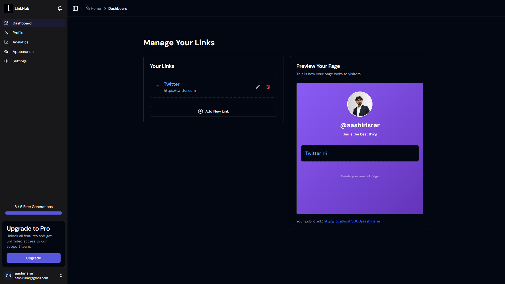

# 🚀 Linkshubb

[](LICENSE)
[](https://linkshubb.vercel.app)

Linkshubb is a modern link-management platform where users can create, organize, and share personalized link profiles, similar to Linktree but cleaner, faster, and fully customizable.

**Live Demo:** [https://linkshubb.vercel.app](https://linkshubb.vercel.app)

---

## 📌 Features

- 🔐 **Authentication** (NextAuth + Google/GitHub OAuth)
- 🧩 **Create / Edit / Delete** links
- 🎨 **Customizable public profile** (`/username`)
- 📈 Optional analytics tracking (click counts)
- ⚡ **Next.js App Router** + Server Actions
- 📁 **MongoDB + Prisma** for data persistence
- 📱 Fully responsive UI (Tailwind CSS)
- 🚀 Ready for production deployment on Vercel

---

## 🏗️ Tech Stack

- **Frontend:** Next.js 14, Tailwind CSS
- **Backend:** Next.js API Routes / Prisma ORM
- **Database:** MongoDB (Atlas)
- **Authentication:** NextAuth.js
- **Hosting / Deployment:** Vercel

---

## 📂 Project Structure

```bash
linkshubb/
│
├── app/
│   ├── (dashboard)/
│   │   └── (routes)/
│   │       ├── profile/       → Profile management
│   │       └── settings/      → Account settings
│   │
│   ├── (landing)/             → Landing page
│   │
│   ├── [username]/            → Public profile dynamic route
│   │
│   ├── actions/               → Server Actions
│   │   ├── getCurrentUser.ts
│   │   ├── getSubscription.ts
│   │   └── getUserByUsername.ts
│   │
│   ├── api/
│   │   ├── auth/[...nextauth]/
│   │   ├── links/
│   │   │   ├── [linkId]/
│   │   │   │   ├── click/     → Click tracking
│   │   │   │   └── route.ts   → CRUD for specific link
│   │   │   └── reorder/       → Drag-and-drop reordering
│   │   ├── polar/             → Analytics integration
│   │   ├── register/          → User registration
│   │   └── s3-upload/         → Image uploads
│   │
│   ├── hooks/                 → Custom React hooks
│   ├── providers/             → Context providers (Toast, Modal, etc.)
│   └── globals.css
│
├── components/                → Reusable UI components
├── constants/                 → Static data & config
├── lib/                       → Utils, DB connection, Auth config
└── public/                    → Static assets
```

---

## ⚙️ Installation & Setup

### **1. Clone the repository**
```bash
git clone [https://github.com/aashirisrar/web-programming-project.git](https://github.com/aashirisrar/web-programming-project.git)
cd linkshubb
```

### **2. Install dependencies**
```bash
npm install
```

### **3. Environment Variables**
Create a `.env` file in the root directory:

```env
DATABASE_URL="your-mongodb-atlas-url"

NEXTAUTH_SECRET="your-secret-key"

AUTH_GITHUB_ID=
AUTH_GITHUB_SECRET=

AUTH_GOOGLE_ID=
AUTH_GOOGLE_SECRET=

NEXT_PUBLIC_APP_URL=

POLAR_ACCESS_TOKEN=
POLAR_PRODUCT_ID=
POLAR_SUCCESS_URL=

# S3 Configuration for next-s3-upload
S3_UPLOAD_KEY=
S3_UPLOAD_SECRET=
S3_UPLOAD_BUCKET=
S3_UPLOAD_REGION=

```

### **4. Prisma Setup**
```bash
npx prisma generate
npx prisma db push
```

### **5. Run Locally**
```bash
npm run dev
```
App will run at: `http://localhost:3000`

---

## 🔌 API Endpoints

### Authentication (NextAuth)
- `POST /api/auth/signin`
- `POST /api/auth/signout`

### Links
- `GET    /api/links`            → Fetch all links for authenticated user
- `POST   /api/links`            → Create a new link
- `PUT    /api/links/:id`        → Update a link by ID
- `DELETE /api/links/:id`        → Delete a link by ID
- `PATCH  /api/links/reorder`    → Update link order

### Public Profile
- `GET /api/public/:username`     → Fetch links for a public user profile

---

## 🖼️ Screenshots

**Dashboard:**


**Analytics Page:**


---

## 🌐 Deployment

The project is deployed on Vercel:

- **Frontend + API:** [https://linkshubb.vercel.app](https://linkshubb.vercel.app)
- **Example Public Profile:** [https://linkshubb.vercel.app/aashir](https://linkshubb.vercel.app/aashir)

---

## 🤝 Contributing

1. Fork the repository
2. Create your feature branch (`git checkout -b feature/new-feature`)
3. Commit your changes (`git commit -m 'Add new feature'`)
4. Push to the branch (`git push origin feature/new-feature`)
5. Open a Pull Request

---

## 📄 License

This project is licensed under the MIT License — see the [LICENSE](LICENSE) file for details.